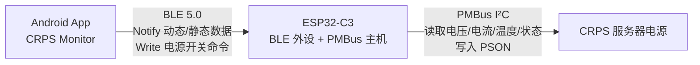

# CRPS Monitor (Compose)

CRPS 服务器电源实时监控 Android 应用，基于 **Kotlin + Jetpack Compose** 重写（原 Java 版重构）。通过 **BLE** 连接 **ESP32-C3**，实时监控服务器电源（CRPS）的电压、电流、功率、效率、温度与风扇状态。

> 版本 V1.0 (Compose) —— 完整功能迁移 + 全新 Compose 界面。

## 通信架构



## 数据协议

| 数据 | 频率 | 特征 UUID | 说明 |
|---|---|---|---|
| 动态数据 | 250ms / 4Hz | `00002A56` | 电压/电流/功率/效率/温度/风扇/状态位/运行时间 |
| 静态信息 | 5s | `00002A58` | 厂商信息/序列号/生产日期/修订版本 |
| 电源控制 | 写入 | `00002A57` | 1 字节命令：`0x01` 开机、`0x00` 关机 |

- 服务 UUID：`00001815-0000-1000-8000-00805f9b34fb`
- JSON 动态字段：`vin, iin, vout, iout, pout, eff, fan, t1, t2, rt, pwr, si, sn, st, sf`
- 曲线 X 轴采用本地单调时钟推进，保证 4Hz 数据均匀铺满时间轴。

## 功能

- **电源控制页**：设备扫描/连接、电源开关（含超时确认重试）、AC 输入 / DC 输出实时读数、转换效率独立卡片、温度/风扇监控、断连遮罩
- **图表页**：六路单线实时曲线（Vout / Iout / Pout / Eff / T1 / T2），60fps 丝滑滚动，三次贝塞尔平滑 + 渐变面积，头部实时数值与状态圆点，运行时间卡片
- **信息页**：静态电源信息（厂商、型号、序列号、产地、生产日期、修订版本）、状态寄存器、PMBus 版本
- **主题**：12 套预设配色 + 深浅模式（跟随系统 / 亮 / 暗）

## 环境

- minSdk 26 / targetSdk 36, Kotlin + Jetpack Compose (Material 3)
- 需预授权：`BLUETOOTH_SCAN`、`BLUETOOTH_CONNECT`（Android 12+）

## 构建

```bash
./gradlew assembleRelease   # 产物: app/build/outputs/apk/release/app-release.apk
```

> 固件（ESP32-C3）与设计素材不在此仓库中开源。

## 更新日志

见 [CHANGELOG.md](CHANGELOG.md)。